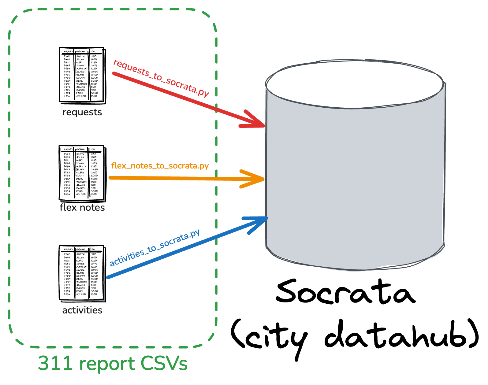

# Transportation & Public Works 3-1-1 Reporting

This repo contains scripts that the Austin Transportation and Public Works Department uses for 311 CSR reporting and visualization.

***

## CSV Reporting 

### CSR to Socrata 

This python script pulls CSV reports from the [City's 3-1-1 system](https://www.austintexas.gov/department/311). These reports contain information on what was reported by the Customer Service Request (CSR) from the public and when/how the department took action to resolve it. These reports are then stored in a City datahub dataset.



`csr_to_socrata.py` processes a report that contains CSR-level data on 3-1-1 service requests. There is one row per service request.

`python -m etl.csv_reporting.csr_to_socrata`

### Flex Notes to Socrata

"Flex notes" are questions that are asked based on the type of CSR that is submitted. Each CSR can have multiple flex questions/answers. `flex_notes_to_socrata.py` processes a report that contains the flex notes.

`python -m etl.csv_reporting.flex_notes_to_socrata`

### Activities to Socrata

CSRs typically contain activities which document the steps that city staff have taken to resolve a CSR. `activities_to_socrata.py` processes a csv report that contains activities.

`python -m etl.csv_reporting.activities_to_socrata`

***

## Open311

### Open311 to Socrata

This script utilizes the [Austin Open311 website's](https://311.austintexas.gov/) API to download CSR data and store it 
in a Socrata open data portal dataset. This allows for more frequent updates as compared to the CSV reporting which is 
run once daily. This is then used to create a real-time updating map for ATPW to visualize CSRs during emergencies for priorization.

Supplying no arguments will check the Socrata dataset for the most recently updated record and will retrieve CSRs that have been updated 
since that date.

`python -m etl.open311.open311_to_socrata`

Supplying a date (with either `-d` or `--date`) that will retrieve all CSRs updated after that date (technically 10 minutes is subtracted)

`python -m etl.open311.open311_to_socrata -d 2025-10-15T06:55:01.132759+00:00`


***

## Environment variables

All required environment variables are in `env_template` and can be found in our password storage. 

An API key for Open311 can be requested [here](https://311.austintexas.gov/open311).

## Network

Note that you also must be on the City network or you will likely not be able to retrieve the reports from 3-1-1. You will see this error:

```
Unexpected file type returned from the CSV endpoint. Check that you are on the city network. 

It's likely that your request is getting flagged as a bot by the web app firewall.
```

## Docker

This repo can be used with a docker container. You can either build it yourself with:

`$ docker build . -t dts-311-reporting:production`

or pull from our dockerhub account:

`$ docker pull atddocker/dts-311-reporting:production`

Then, provide the environment variables described in env_template to the docker image:

`$ docker run -it --env-file env_file dts-311-reporting:production /bin/bash` 

Then, provide the command you would like to run.