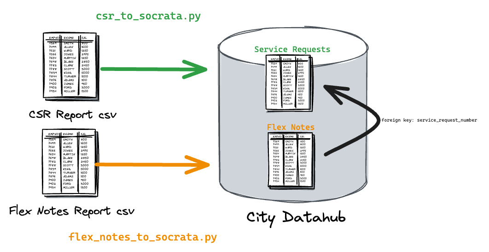

# Transportation & Public Works 3-1-1 Reporting

This repo contains python scripts that pull CSV reports from the [City's 3-1-1 system](https://www.austintexas.gov/department/311). These reports contain information on what was reported by the Customer Service Request (CSR) from the public and when/how the department took action to resolve it. These reports are then stored in a City datahub dataset.



## CSRs to Socrata

`csr_to_socrata.py` processes a report that contains CSR-level data on 3-1-1 service requests. There is one row per service request.

`$ python etl/csr_to_socrata.py`

## Flex Notes to Socrata

"Flex notes" are questions that are asked based on the type of CSR that is submitted. Each CSR can have multiple flex questions/answers. `flex_notes_to_socrata.py` processes a report that contains the flex notes.

`$ python etl/flex_notes_to_socrata.py`

## Activities to Socrata

CSRs typically contain activities which document the steps that city staff have taken to resolve a CSR. `activities_to_socrata.py` processes a csv report that contains activities.

`$ python etl/activities_to_socrata.py`

## Environment variables

All required environment variables are in `env_template` and can be found in our password storage. 

## Network

Note that you also must be on the City network or you will likely not be able to retrieve the reports from 3-1-1. You will see this error:

```
Unexpected file type returned from the CSV endpoint. Check that you are on the city network. 

It's likely that your request is getting flagged as a bot by the web app firewall.
```

## Docker

This repo can be used with a docker container. You can either build it yourself with:

`$ docker build . -t dts-311-reporting:production`

or pull from our dockerhub account:

`$ docker pull atddocker/dts-311-reporting:production`

Then, provide the environment variables described in env_template to the docker image:

`$ docker run -it --env-file env_file dts-311-reporting:production /bin/bash` 

Then, provide the command you would like to run.